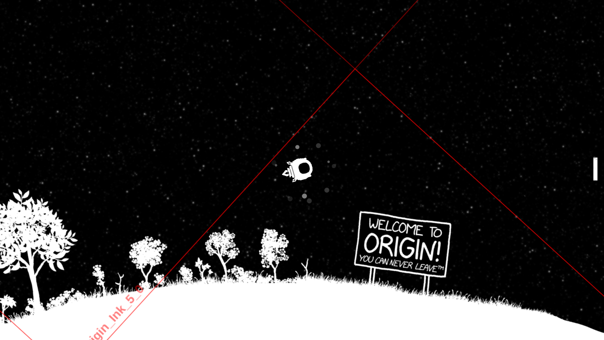
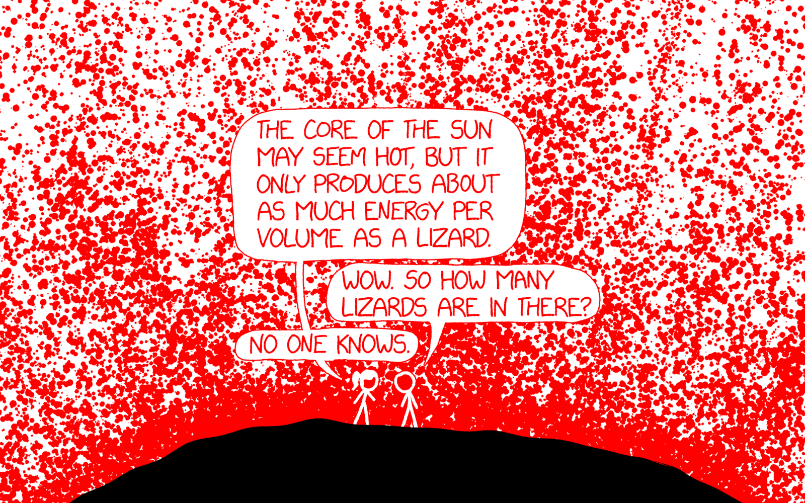
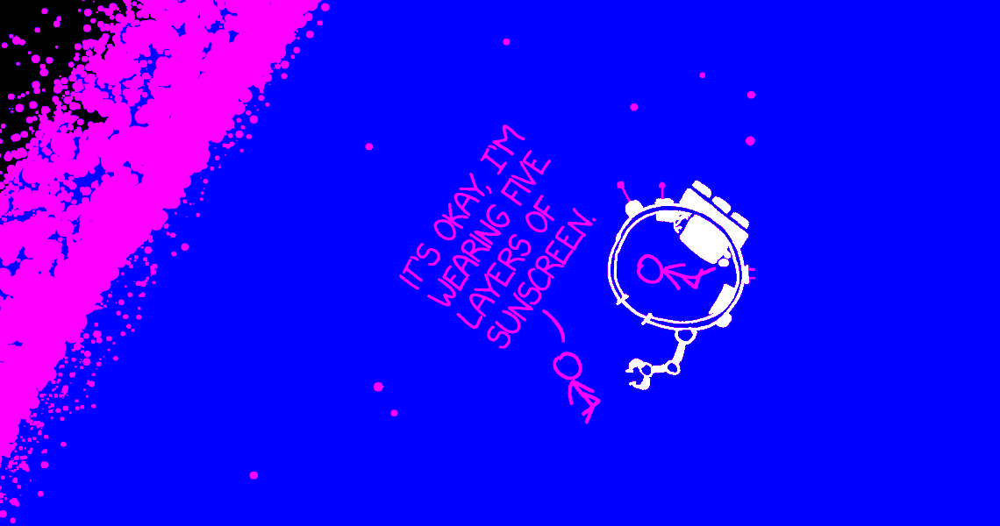
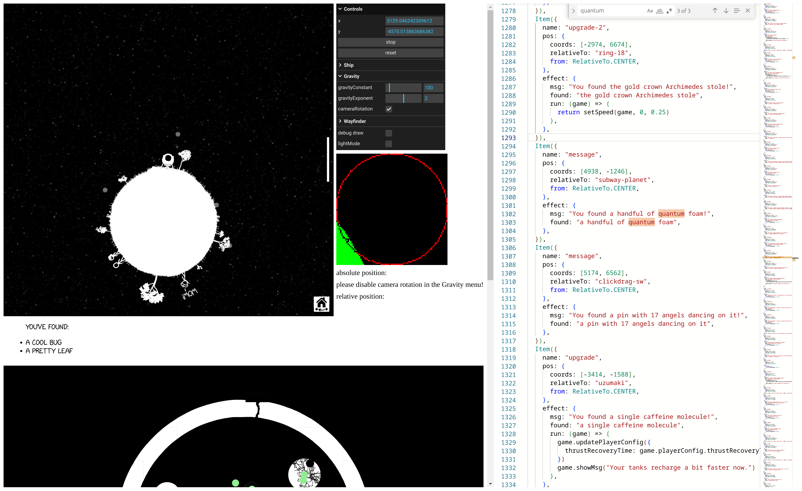

# Development notes from xkcd's "Gravity" and "Escape Speed"



On April 20th, xkcd published **[Escape Speed](https://xkcd.com/2765/)**, the 14th annual April Fools comic we've made together. Escape Seed is a large space exploration game created and drawn by Randall Munroe. I coded the engine and editor, with game logic and asset processing by davean. The game map was edited by [Patrick Clapp](https://www.instagram.com/fading_interest), [Amber](https://amberyu.st), [Kevin](https://amberyu.st), [Benjamin Staffin](https://twitter.com/bstaffin), and [Janelle Shane](https://www.aiweirdness.com).

This was one of the most ambitious -- and most delayed -- April Fools comics we've ever shipped. The art, physics, story, game logic, and render performance all needed to work together to pull this off. We decided to take the time to get it right.

The game is a spiritual successor to last year's [Gravity](https://xkcd.com/2712) space exploration comic. Our goal was to deepen the game with a bigger map and more orbital mechanics challenges to play with.

Here's a few stories from the development of these two games.

---

## Spherical cows

There's this [old physics joke](https://en.wikipedia.org/wiki/Spherical_cow) about simplifying the model to ease calculation.

For this comic, we took it literally.

When we made [Hoverboard](https://xkcd.com/1608) in 2015, Randall made a clever decision to avoid drawing a walk cycle: give the character a hoverboard. This papered over a _ton_ of collision glitches too.

<div class="grid grid-2 grid-collapse-col outline-2 bg-black wide" style="gap: 8px">

<video muted playsinline autoplay loop>
  <source type="video/webm" src="/post/xkcd-gravity-escape-speed/hoverboard-collision.webm">
  <source type="video/mp4"  src="/post/xkcd-gravity-escape-speed/hoverboard-collision.mp4">
</video>

<video muted playsinline autoplay loop>
  <source type="video/webm" src="/post/xkcd-gravity-escape-speed/shield-collision.webm">
  <source type="video/mp4" src="/post/xkcd-gravity-escape-speed/shield-collision.mp4">
</video>

</div>

For [Gravity](https://xkcd.com/2712), I faced a similar predicament. Here's an excerpt from our chat:

![A screenshot of a Slack chat log transcript:
gentlemen, I've been thinking a lot about collisions
I've so far been imagining how the ship will bounce off of things in the environment, and what that should feel like
a scenario I really haven't liked is when the ship is traveling at a tangent to a planet and lands with a lot of lateral speed
if we naively auto rotate the ship upright when altitude is close to landing, it's gonna look really cheesy as the ship has to decelerate fast or weirdly slides across the surface
I also think it's kinda weird to have this indestructible ship which bounces elastically off everything
so, I had an idea, a wonderfully stupid hoverboard level idea
we give the ship a shield.
what if we drew a circle around the ship whenever there's collision contact around a fixed radius
suddenly all sorts of awkward collision or navigation problems disappear, AND it explains why this ship don't blow up](../../../public/post/xkcd-gravity-escape-speed/collision-chat.png)

It's almost always a win to simplify the requirements. I love when a simplification is both clearer to understand and easier to implement. The shield is cheesy, but it works!

## Designing for discovery in an empty space

Space is vast and mostly empty. Unlike hoverboard, where basic movement leads you to new discoveries, moving arbitrarily in a space game quickly gets you lost:


We knew that guiding players towards interesting places would be a core design problem. One of Randall's ideas was to have a "compass" pointing towards the nearest point of interest. This evolved into a cloud of dots around the ship with subtle cues for object distance and size:

<div class="outline-2 bg-black" style="gap: 8px">

<video muted playsinline autoplay loop>
  <source type="video/webm" src="/post/xkcd-gravity-escape-speed/space-navigation-zoom.webm">
  <source type="video/mp4" src="/post/xkcd-gravity-escape-speed/space-navigation-zoom.mp4">
</video>

</div>

Another useful mechanic was to make the camera rotate so that the direction gravity's pointing is down. This was originally so that planets would rotate under you as you orbited them (turning text upright), but we also discovered it was a useful cue for when you were approaching something. The starfield and dot cloud "wayfinder" helped to make this camera rotation legible.

Finally, we added some signs around the map. This gave players ambient awareness of notable story areas before visiting them.

## Collision map steganography

One challenge that always comes up when we make an explorable comic is collision mapping. We want to control which areas are passable independently from display, so we can create secret passages! 🤫

Typically we've hidden collision data in the [least significant bit (LSB)](https://en.wikipedia.org/wiki/Least_significant_bit) of one of the color channels. When Randall draws the map, he uses solid colors (usually red) to indicate special passable areas, and we update the colors in our image processing scripts.

This was the approach we used for Hoverboard and Gravity. For each frame, we render the vicinity around the player to an offscreen canvas and check the LSB values for passability (e.g. even&nbsp;=&nbsp;solid, odd&nbsp;=&nbsp;passable). You can run `ze.goggles()` in the JS console to see this hidden collision canvas (with some debug overlays added).


This works reasonably well, but you have to be careful around antialiasing. Since resizing adds interpolated grayscale values to the image, this can add unintended LSB values to the images.

Hoverboard used a hack which only considered dark pixels (channel value < 100) for the LSB checks. For Gravity, we wanted both light and dark passable areas, so davean wrote a custom image resizer to preserve the LSB values.



We also started using transparency in the images so we could have multiple overlapped layers with a moving starfield background. While sound in theory, adding alpha caused a lot of pain. We kept finding areas with phantom collidability which didn't appear in the source images. After hours of tedious debugging and pixel peeping, I discovered that canvas uses [premultiplied alpha](https://en.wikipedia.org/wiki/Premultiplied_alpha) in the backing store. This [can cause values in the canvas to mismatch what was written](https://stackoverflow.com/q/23497925).

We resorted to a backup plan proposed by davean: render the collision data into the LSB of the alpha channel (the alpha channel itself isn't premultiplied). This wasn't without its own issues (e.g. when flattening multiple layers into the collision canvas, their alpha values sum) -- but it worked well enough to ship.

## An awesome SVG hack, dashed by Safari

For Escape Speed, we wanted to find a cleaner approach for collision maps. A lingering issue with using the alpha channel was some encoded values would be very slightly transparent. I had hoped to process the image data client-side to fix the alpha values (e.g. rounding 254 up to 255), but in practice this was an unacceptable performance trade-off.

What if we could remap the color channels using CSS? It turns out this is possible using [SVG filters](https://blog.logrocket.com/complete-guide-using-css-filters-svgs/#fecolormatrix)! We can use a matrix transform to map the red channel to luminosity, blue to alpha, and leave green for collision:

```html
<filter id="bw" x="0" y="0" width="100%" height="100%">
  <feColorMatrix
    type="matrix"
    values="1 0 0 0 0
            1 0 0 0 0
            1 0 0 0 0
            0 0 1 0 0"
  />
</filter>
```

Here's what the image data looks like with these color mappings:



This was a fantastic solution. It worked nicely during early development. Unfortunately once we tested more, we discovered [SVG filters are unusably slow in Safari](https://stackoverflow.com/questions/53145883/how-to-use-a-simple-svg-filter-on-safari-with-acceptable-performance-and-without). :(

Back to the drawing board...


It was March 29th, and at this point we wanted whatever was most likely to work. Elegance be damned. We switched to what we'd been avoiding the whole time: separate collision map images. This doubled the images downloaded, but it wasn't too bad: the monochrome images compress well and HTTP/2 or QUIC make it less of a perf hit than in our early 2010s tiled games.

## An unlikely niche for TypeScript

As our games have grown in complexity, so have the accompanying datasets:

- Hoverboard had a an array of coin positions
- Gravity had a JSON blob describing planet locations and sizes
- Escape Speed has a TypeScript map and IDE:

<div class="outline-1 wide">



</div>

To make editing and expanding the game map ergonomic, we knew early on we'd want a live editor. Unexpectedly, I found that a VSCode-like TypeScript editor was the sweet spot. This followed from a couple decisions motivated by efficiency:

- We knew we'd want some kind of linting or validation on the map to catch mistakes before they hit production.

- Our asset pipeline outputs a JSON data with all of the layer names and dimensions. We could use this in the types to give editors realtime feedback on possible options and catch typos!

  ```ts
  export type LocationName = keyof typeof imageData.locations
  export type LayerName<Name extends LocationName> =
    keyof (typeof imageData)['locations'][Name]['layers']
  ```

- The easiest way to get a good live TypeScript editing experience was to pull in [Monaco](https://microsoft.github.io/monaco-editor).

Compared to building a validator in CI (slow iteration feedback) or a visual editor (huge scope), TypeScript was quick to adopt and easy enough to manipulate. Putting everything in a web page made it super easy to onboard collaborators: rather than cloning a repo and installing a toolchain, they got a state of the art code editor in one click.

The editor embeds [`rollup`](https://github.com/rollup/rollup) to compile the map files in the browser, and [`prettier`](https://github.com/prettier/prettier) to keep code style consistent. It's kind of amazing to me that the logical path led to building a custom IDE, and actually _reduced_ the amount of stuff I had to build!

## Game engine growing pains: constant timestep

This bug arrived the way most tricky ones do, with an impossible-seeming observation. Randall noticed his ship somehow had less thrust than earlier in the day. Retracing his steps, he'd been testing the game at his office, lugged into his drawing tablet display. Now, running on his laptop, the gravity seemed _wrong_ somehow. Several other people investigated and saw no difference.

Randall had recently upgraded to an M2 Macbook Pro, which has a 120hz variable refresh rate display. Oh no. I tested on my gaming monitor, and sure enough, I was now seeing it too.

Some of this physics code dates back to Hoverboard, which ran ticks in sync with drawing frames. More frames = faster physics ticks. However, with 8 more years of wisdom working on Gravity, I'd updated this code to factor in frame delta time. In theory, this would compensate for variation in frame times. I combed through the physics tick function and fixed a couple minor cases I'd missed, but the movement wasn't any better.

![xkcd #1700, "New Bug" (transcript from explainxkcd.com):
[Cueball sits at his desk in front of his computer leaning back and turning away from it to speak to a person off-panel.]
Cueball: Can you take a look at the bug I just opened?
Off-panel voice: Uh oh.
[Zoom out and pan to show only Cueball sitting on his chair facing away from the computer, which is now off-panel. The person speaking to him is still of panel even though this panel is much broader.]
Off-panel voice: Is this a normal bug, or one of those horrifying ones that prove your whole project is broken beyond repair and should be burned to the ground?
[Zoom in on Cueball's head and upper torso.]
Cueball: It's a normal one this time, I promise.
Off-panel voice: OK, what's the bug?
[Back to a view similar to the first panel where Cueball has turned towards the computer and points at the screen with one hand.]
Cueball (edited from the original comic with a screenshot of a Slack message): ok so why did gravity change?
Off-panel voice: I'll get the lighter fluid.
](../../../public/post/xkcd-gravity-escape-speed/new-bug.png)

I consulted davean's deep knowledge of game programming techniques. We walked through the code together over Discord. Neither of us could spot an obvious problem with the formulae until we started stepping through the physics state tick by tick. At last, we spotted a deeper problem!

The ship has a special behavior when launching from a landed state: it gets an extra boost of thrust. While not realistic, this made launching feel tight and responsive. This "launch speed" was set to provide 2500x the normal acceleration, lasting only a single frame. Even with frame delta time factored in, the physics integrator was not accurate enough for a 1 tick acceleration of this magnitude to be consistent between 60 and 120hz.

The solution was to switch to a [constant timestep](https://gafferongames.com/post/fix_your_timestep). Instead of ticking with the frame updates, we use a constant physics tick rate of 120hz. When a frame is drawn, we run the physics to "catch up" to the current time in fixed steps. However! Now that physics isn't ticking in sync with frames, we have to [lerp](https://en.wikipedia.org/wiki/Linear_interpolation) your position to account for the frame happening between two physics ticks.

This is probably table stakes for anyone who's written a game physics engine, but the naive approach had been good enough up to this point. No one had noticed the variation in behavior until we fine-tuned the ship to barely be able to escape the starting planet.

One of the beautiful things about revisiting old code is it shows you how your way of thinking has changed. Looking through old Hoverboard source, I could anticipate bugs I'd missed. Places jumped out where I'd take a different approach. I understand these problems better now because I've seen more. I'll probably look back on Escape Speed someday in a similar way.

---

I hope you enjoyed these stories from our development of [Escape Speed](https://xkcd.com/2764/) and [Gravity](https://xkcd.com/2712). We had a ton of fun making these comics, and hope have fun exploring them too. If you'd like to read more xkcd stories, check out [Notes from the development of xkcd's "Pixels"](/post/notes-on-xkcd-pixels) and [Checkbox](/post/checkbox).
