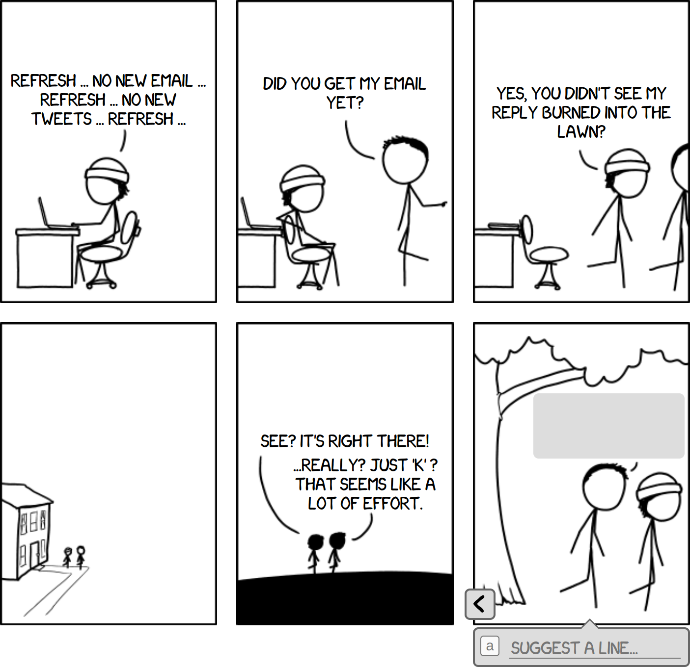
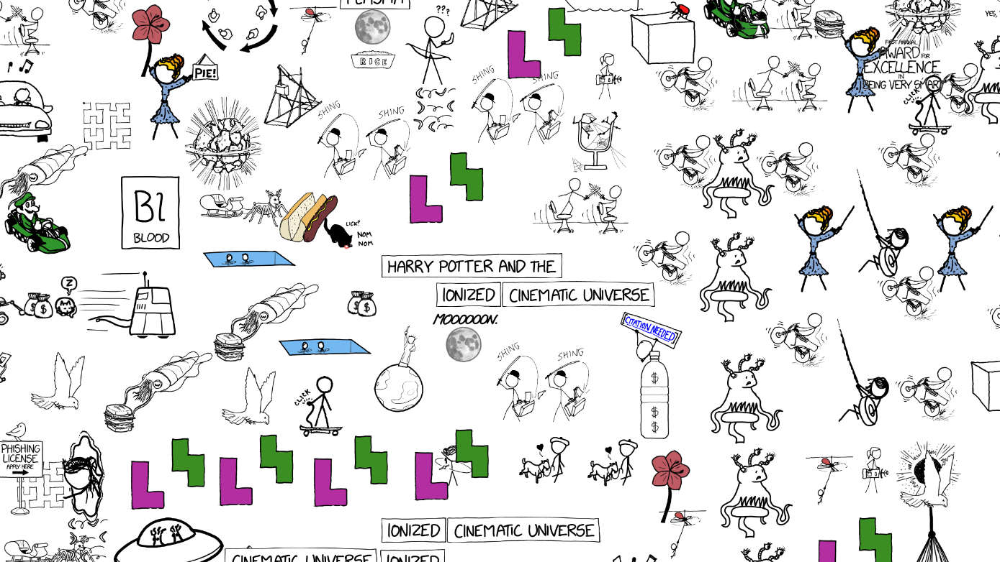
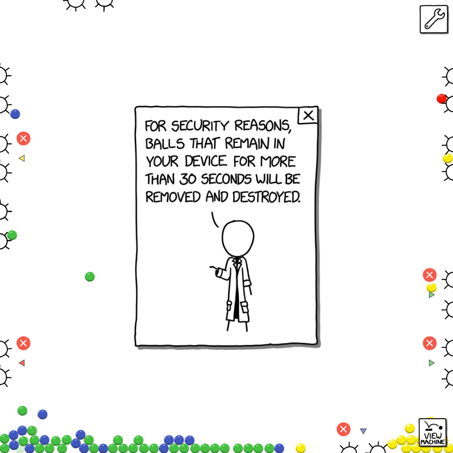

import LazyBunnyVideo from '@components/LazyBunnyVideo'

  <LazyBunnyVideo client:load  width="1278" height="720" url="https://vz-ab48ae95-d30.b-cdn.net/05b98682-71de-43ae-bbf6-758f67533faa" poster="https://vz-ab48ae95-d30.b-cdn.net/05b98682-71de-43ae-bbf6-758f67533faa/thumbnail_837890d0.jpg" muted playsinline autoplay loop controls />

On April 5th, xkcd released **[Machine](https://xkcd.com/2916/)**, the 15th annual April Fools project I've made with them.

It's a game we'd been dreaming of for years: a giant [rube goldberg machine](https://en.wikipedia.org/wiki/Rube_Goldberg_machine) builder in the style of the classic [Incredible Machine](https://en.wikipedia.org/wiki/The_Incredible_Machine) games, made of a patchwork of machines created by individual xkcd readers. For more details, check out [Explain xkcd's wonderful writeup](https://www.explainxkcd.com/wiki/index.php/2916:_Machine).

This is the story of how we built Machine in 3 weeks, and what I learned along the way.

April 1st is a special occasion where I and others collaborate with xkcd on ambitious interactive comics. This project had the largest group of contributors to date! Expand for full credits.

- Randall, davean, and I created the art, backend, and frontend respectively.
- [Ed White](https://github.com/spyhi) designed and built the moderator UI.
- [Alex Garcia](https://twitter.com/uh_oh_thats_bad) implemented the hook, wheel, prism, and cat widgets, with contributions to the React physics integration.
- [Kevin Cotrone](https://twitter.com/cotrone) wrote the meta machine generator which determines which inputs and outputs each tile has, and built backend infrastructure.
- [Conor Stokes](http://burningcandle.io) (with his daughter Ami) implemented the cushion, bumper family of widgets, and refined the physics stepper.
- [Liran Nuna](https://liranuna.com) implemented the boat that floats at the bottom of the comic.
- [Benjamin Staffin](https://github.com/benley) improved the deployment pipeline and moderated submissions.
- [Manish Goregaokar](https://manishearth.github.io/), [Patrick](https://www.instagram.com/fading_interest), [Amber](https://github.com/ayust), and [Michael Leuchtenburg](https://github.com/dyfrgi) moderated submissions and gave creative feedback.

---

## Early machinations

It took us deep into March, turning around ideas we were _kinda_ excited about, to find the one that had us all sitting bolt upright.

> "Could we make a really big tiled mechanism like the blue balls GIF? Where everyone contributes a small square?"

This referenced a [classic viral GIF from 2005](https://blueballfixed.ytmnd.com) (warning: loud music), which was a collaboration [composed of tiles made by Something Awful users](https://ytmnd-fads.fandom.com/wiki/Blue_Ball_Machine):

Sometimes an idea _feels_ like it emerges fully-formed, but when you start talking about it, you realize there's still a dizzying array of decisions to make. Thus ensued 5 days of brainstorming to discover each of us had slightly different core beliefs about what this comic should be:

- Where do the balls come from?
- Does everyone see the same machine? What is its purpose?
- How can players interact with it?
- And most importantly... _why do they_?

## Learning from previous attempts

My favorite and least favorite interactive comics we've ever done have centered around user contributed content. My personal fave was [Lorenz](https://xkcd.com/1350), an [exquisite corpse](https://en.wikipedia.org/wiki/Exquisite_corpse) where readers evolved jokes and storylines by writing in panel text. So much fun!

It doesn't always work out how we hoped, though. Take 2020's [Collector's Edition](https://xkcd.com/2288):

In Collector's Edition, players found stickers scattered across the xkcd archives. They could then place each sticker once, permanently, on a global shared canvas.

Wouldn't it be cool if readers could make their own comic panels together? This was the idea we started with, which got pared down to the sticker concept.

Unfortunately, the game design didn't yield the desired results:

- The initial view for all players was the center of the map, which was initially blank. It quickly descended into chaos. Chaos became every player's first impression of the game.

- There was no incentive to carefully consider where to place a sticker. Players didn't have enough agency to advance the plot through their individual action. This limited creativity to simple patterns like tiling similar stickers or forming lines.

- We didn't provide an overarching story or goal. The stickers you had didn't obviously relate to the others already on the page (the fridge poetry magnets were fun, though).

For a collective canvas to shine, the experience should teach you by example what's cool to make with it. It helps to have a shared context and purpose which motivates what to create.

## Designing constraints

Once we knew we were building a big collaborative marble drop, we were awash with too many choices. Many early approaches seemed like unsatisfying trade-offs, or very difficult to implement. The only thing we were really sure of was there would be a grid of interconnected machines players would create.

How big should the overall machine be? Let's consider 100x100, arbitrarily. How would we simulate it? Running 10,000 tiles in realtime on the client, each with tens of balls, seemed like a risky goal.

Also, how could players create subdivisions of a large, complex machine without communicating directly? How would we know tiles designed in isolation would work when integrated together?

Many thought experiments later, we ended up with **3 core principles**:

### 1. Maximize player expressiveness at the cost of correctness.

How predictable did the machine need to be? We considered running the whole thing server side. Another option was to simulate individual machine tiles to validate them. This would give us some assurance that when everything was connected, the machine would work.

Perhaps if the machines were deterministic enough, we could also estimate the rate balls exited each tile. We could use that to approximate the overall flow of the machine, so we could feed tiles balls at the proper rate without running every tile.

Once we had a prototype editor running, Davean quickly dispelled this idea by creating a machine with long patterns of chaotic ball collisions:

  <LazyBunnyVideo client:idle width={1264} height={1196} url="https://vz-ab48ae95-d30.b-cdn.net/293f6bc1-8d78-47b9-8853-191a2a28f075" muted playsinline autoplay loop controls />

Unless balls moved in straight uninterrupted paths, clearly it was easy for players to make very unpredictable machines. Randall wryly suggested we add [double pendulums](https://en.wikipedia.org/wiki/Double_pendulum).

From a design standpoint, this settled that making the machines more predictable would trade against degrees of freedom players had. Also, in the face of a tight deadline, it's best to keep it simple, which favored an approach light on prediction or simulation.

We decided to prioritize players having tons of flexibility in what they could build -- even extremely nondeterministic or broken machines. This meant we'd need active moderation, both to verify that machines satisfied the constraints, and to remove any offensive content.

### 2. Give players firm constraints that encourage resilient, interchangeable machines.

Accepting moderation and unpredictable player machines made another useful decision for us: ironically, it forced us to require more order between the machines.

Early on, we'd considered making the inputs and outputs of machines totally free-form: where previous tiles output balls on their edges, future players would build outwards incrementally. Then we looked at how moderation would work. There was the possibility that we'd need to replace a tile from early on.

If tile designs depended on previous ones, this could break a large portion of the machine. This led us to design tight enough constraints that multiple players would create compatible designs within the same tile space.

  <LazyBunnyVideo client:idle width={1268} height={808} url="https://vz-ab48ae95-d30.b-cdn.net/d619a23e-093b-47d4-aef8-e8dac0c65f55" muted playsinline autoplay loop controls />

This is the [Robustness principle](https://en.wikipedia.org/wiki/Robustness_principle) in action: "be conservative in what you send, be liberal in what you accept".

To provide players with input and output constraints, we'd need a map of the whole machine from the start. Generating the map also gave us the opportunity to vary how challenging the machines would be (we called the tile configurations "puzzles"). Kevin's [map generator](https://github.com/xkcd/incredible/blob/3f8660708203d7e60c146ef4998cfd377c6af2b8/src/Incredible/Puzzle.hs#L89) transitions from simple single-input single-output puzzles to complex 4-in-4-out merges in the middle, back to 2 outputs per tile at the end.

On the player side, we designed the constraints so we could give players realtime feedback as they constructed their tile. By requiring that tiles output balls on average at roughly the same rate as they received them, we could discourage machines that ate balls or created a lot of latency (e.g. pooling them up). We [chaos tested](https://en.wikipedia.org/wiki/Chaos_engineering) tiles by randomizing the rate of balls entering the editor to reflect the variance upstream.

Our general philosophy became "run the machines for a while, see if on average they meet the constraints given uneven input".

### 3. Machines should reach a steady state in the first 30 seconds.

This led to a new question: how long would moderators have to watch? We made the arbitrary decision that it should take 30 seconds for machines to enter a steady state, based on napkin math for how long it'd take to moderate the whole machine (e.g. 10k tiles => 83.3 hours).

We also made balls expire after 30s. Initially, when there was no expiration, I noticed that everyone's first experience was balls piling up and filling their screen while they learned how to play the game. This would also bog down the physics simulation as it accumulated a huge number of active rigid bodies. Instead of being fun, the balls were getting in the way!

Expiring the balls helped players fall into a pit of success, because machines would not accumulate errors over time. It also drastically simplified moderation, because after watching for 30 seconds, you've seen where most balls can end up in their lifetime.

## Simulation and hyperreality

**The architecture of Machine made two big bets**. The first was: with all of the above design constraints in place, connecting together disparate tiles into an overall machine would work. We generated and solved a few smaller maps to shake that out.

Back to another problem, though: how could we display a giant machine if we couldn't run it in realtime on either the server or client?

Before reading further, I'd encourage you to send a little time [scrolling around the comic](https://xkcd.com/2916) and imagine how it works. Because what follows will spoil it in a big way.

As a northstar, I wanted it to be possible to follow a single ball from the top of the machine to the bottom. This meant that even if the whole machine wasn't being simulated, a window around what the player sees would need to be.

Once an early version of the map viewer was working, I started testing out an infinite map with only the viewable area simulated. It looked pretty good -- but you can see gaps in the flow when I scroll up, because the initial state of the tiles was empty as they enter the simulation.

  <LazyBunnyVideo client:idle width={694} height={694} url="https://vz-ab48ae95-d30.b-cdn.net/8d018edd-bfba-4c00-ab49-ef34670bbfcd" muted playsinline autoplay loop controls />

Instead of an empty tile, we needed them to appear to already have activity in them. So here's the second bet: we'd snapshot tiles after they'd reached their steady state, only bringing the snapshots into existence just before they scrolled into view. Would players notice?

Here's a view of the final comic, with display clipping turned off (you can do this by disabling the `overflow: hidden` and `contain: paint` CSS properties on the containers):

  <LazyBunnyVideo client:idle width={1788} height={1006} url="https://vz-ab48ae95-d30.b-cdn.net/60f488b9-0e39-4d4a-834f-1f7997c57002" muted playsinline autoplay loop controls />

Did you notice the snapshots? Unless I'm really looking for them, I don't.

Only the tiles you see rendered exist in the physics simulation. Note that there's also a minor display optimization going on: even though you only see the balls inside the viewing area, they're simulated within the whole tile extents. To pretend there's more machine up above the view, balls are created and fed to the tiles at the top row of the simulation (based on the expected rate of their input constraints).

To create snapshots, we tied them into the moderation UI. Mods must wait at least 30 seconds before approving a tile. We then take the snapshot when they click the approve button. This gives mods discretion to wait a little longer for the machine to enter a nice looking state.

  <LazyBunnyVideo client:idle width={1050} height={1050} url="https://vz-ab48ae95-d30.b-cdn.net/49686202-b3a6-4149-8b12-9461f827d16e" muted playsinline autoplay loop controls />

Snapshotting worked way better than we expected. A really nice consequence is that it resets accumulated error in the machine. As you scroll around, your first impression of a tile is a clean good state that a moderator liked. In practice, if you watch long enough, many machines can get wedged into stuck or broken states, but you'll never see them if you keep exploring, because you'll enter fresh snapshots.

The machine you're scrolling around in the comic isn't real. It's [hyperreal](https://en.wikipedia.org/wiki/Hyperreality). The whole thing is never simulated in its entirely, and I think turned out better that way!

## Rendering thousands of balls with React and DOM

Machine is built on the [Rapier](https://rapier.rs) physics engine. Rapier was fantastic to work with: it has great docs, a clean API with lots of useful primitives, and has impressive performance thanks to its Rust implementation (running as WASM in the browser). I was also initially drawn to Rapier's [determinism guarantees](https://rapier.rs/docs/user_guides/javascript/determinism), though we didn't end up doing any server side simulation.

On top of Rapier, I wrote a custom [React context](https://react.dev/learn/passing-data-deeply-with-context), [`<PhysicsContext>`](https://github.com/xkcd/incredible/blob/3f8660708203d7e60c146ef4998cfd377c6af2b8/client/src/components/PhysicsContext.tsx), which creates Rapier physics objects and manages them within the React component lifecycle. This made it easy to develop a "widget" component for each placeable object with physics or collision surfaces. Effectively, React functioned as a quick and dirty [scene graph](https://en.wikipedia.org/wiki/Scene_graph). This simplified loading and unloading tiles as the view scrolled: when a tile unmounts, all of the physics and DOM are cleaned up. As a bonus, it made it easy to wire up hot reloading with fast refresh, which was _really_ nice for tweaking collision shapes:

  <LazyBunnyVideo client:idle width={1694} height={1130} url="https://vz-ab48ae95-d30.b-cdn.net/baa50578-dedc-482c-84c1-d14ffcd2f3cb" muted playsinline autoplay loop controls />

Another cool aspect of the React context approach is that all of the physics hooks noop when they're not inside a `<PhysicsContext>`. This is used to render static previews of tiles for the moderation UI.

I wish I had used components instead of hooks to create rapier objects. I later discovered this is the approach [react-three-rapier](https://github.com/pmndrs/react-three-rapier/tree/main) takes, and it fits better with React diffing (vs. `useEffect` which destroys the old instance and recreates on dependency change).

Machine is rendered entirely using the DOM. During early dev I was leery I'd reach the end of my rope perf-wise. I expected I'd eventually ditch DOM rendering for [PixiJS](https://pixijs.com) or canvas when it got too slow. However, I wanted to see how far I could take it, since it meant less to build.

To optimize rendering performance, the frame loop applies styles directly to widgets with physics simulation. Thus React's diff only runs when structural changes are made to the scene graph. Initially balls were rendered by React, but the frequent creates / removes were low hanging fruit for reducing diffs, so I created their own [optimized renderer](https://github.com/xkcd/incredible/blob/3f8660708203d7e60c146ef4998cfd377c6af2b8/client/src/components/widgets/Balls.tsx#L209). Another win was draw culling for balls and widgets out of view. This performed well with 4000 balls in simulation and hundreds onscreen, so I settled on the DOM-only rendering approach.

I've heard comparisons drawn between modern browsers and game engines, with their tightly optimized GPU rendering and DOM / scene graph. The similarities have never felt more apt.

## API and Moderation

Machine's backend was written in Haskell by davean and Kevin, with redis as backing store. We used OpenAPI with [OpenAPI fetch](https://openapi-ts.pages.dev/openapi-fetch) to share types between the codebases. This approach had some teething pains adapting Haskell types, but ended up very helpful for coordinating late breaking API changes. This was also my first project using [TanStack Query](https://tanstack.com/query/latest), which was quite handy for caching and automatically refreshing the machine without server push.

The moderation UI, designed by [Ed White](https://github.com/spyhi), was critical for us because it bottlenecks all submissions being published. Mods must choose from potentially hundreds of designs for a particular tile. We used a simple but unreasonably effective approach to prioritize the queue. Each type of widget has an [interestingness score](https://github.com/xkcd/incredible/blob/3f8660708203d7e60c146ef4998cfd377c6af2b8/client/src/components/moderation/interestingWeights.ts), and we count each instance to sort candidate tiles. This biases towards maximalist solutions, though mods counteract that by reviewing the middle of the list for more minimal ones.

The large imbalance between the number of submitted designs and those published in the machine is unfortunate -- it's my least favorite thing about this comic. We searched for a way to make more of the back catalog available prior to launching, but there wasn't a good compromise given our moderation time constraints. We'd like to find ways to share more of the submission dataset after live submissions are finished.

One nice UX finding came from the moderation approve cooldown. Since tile snapshot quality is so important, I hacked in a countdown timer which disabled the moderator approve button until at least 30 seconds had passed running the simulation. This ensures that snapshots are taken of a steady state, and gives time to check that outputs are receiving balls at the expected rate. I initially expected this to be annoying to mods, but to my surprise, they liked how it prevented hasty decisions.

Post-launch, I added a slider that allows moderators to speed up the simulation to much faster than realtime. This saves a _ton_ of moderator time, because now the first 30 seconds of a submission can be viewed in under 5 seconds. It's also quite useful for reviewing the behavior over a longer span of time.

  <LazyBunnyVideo client:idle width={984} height={984} url="https://vz-ab48ae95-d30.b-cdn.net/f4b881d5-bb41-4607-9a44-eea326332a42" muted playsinline autoplay loop controls />

## A note of appreciation for the "Jamslunt Interfoggle"

Finally, I'd to take a moment to appreciate one of my favorite machines. It's a great example of how even with all our editor constraints in place, serendipitous and funny unintended consequences happen between tiles.

The "[Jamslunt Interfoggle](https://xkcd.com/2916/#xt=2&yt=2&v=1355)" was posted within the first couple hours the comic was up. It's a clever mechanism that exploits the narrow field of fans. It queues blue colored balls in a chute until they accumulate enough weight to spill out the sides.

_However_.

The tile that ended up above the Interfoggle, "[Bouncy](https://xkcd.com/2916/#xt=2&yt=1&v=1355)", is a chaos engine launching balls across 3 crossing paths. Every once in a while, it will send a green ball through the wrong output, which wrecking-balls through the logjam and sends a cascade of blue balls through the Interfoggle.

  <LazyBunnyVideo client:idle width={1382} height={1382} url="https://vz-ab48ae95-d30.b-cdn.net/38361a2e-2b62-44f2-b1fb-98ccca87e938" muted playsinline autoplay loop controls />

The Interfoggle can't have been designed with this behavior in mind, because we only feed the correct color in the editor (this was a conscious decision to make inputs easier to understand). Yet, this machine is so much better with the green balls in the mix.

One of the great joys of making a project like this is discovering all the creative ways people use it, intentional or not. Even though I know it's coming, I'm continually amazed by how brilliant the internet is when given a shared canvas. Thanks to everyone who contributed tiles.

At the time of writing, there's still a little time to [add your own design](https://xkcd.com/2916) to the final machine.

---

You can check out the [source code of Machine here](https://github.com/xkcd/incredible). Feel free to [drop me a line on Mastodon](https://mastodon.social/@chromakode) if you have any questions about it. One cool thing to hack on would be implementing a full global simulation of the machine. I'm quite curious to see how well it works.

I hope you've enjoyed this deep dive into "Machine". For more xkcd stories, check out these notes from our [space exploration games](/post/xkcd-gravity-escape-speed) and 2021's [Morse Code April Fool's comic](/post/checkbox).